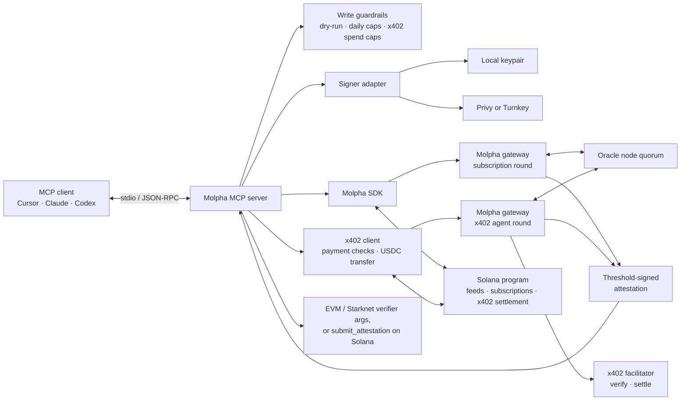

# Molpha MCP

[](https://github.com/molpha/mcp/actions/workflows/ci.yml)
[](LICENSE)
[](package.json)

A [Model Context Protocol (MCP)](https://modelcontextprotocol.io/) server that lets AI agents create, fetch, verify, and publish [Molpha](https://docs.molpha.io/) oracle data.

Molpha turns HTTP API responses into threshold-signed payloads that can be verified on Solana, EVM, and Starknet. This server exposes that workflow as a small set of MCP tools and keeps signing behind a local, Privy, or Turnkey-backed wallet.

> [!WARNING]
> This release targets Solana Devnet and Sepolia verifier networks. Treat it as testnet software, not a production security boundary. Write tools spend SOL, and round tools may consume subscription quota or pay USDC for x402 rounds, unless dry-run mode is enabled.

## What you can do

- Discover the active registry, oracle nodes, gateways, and verifier deployments.
- Derive a source's `sourceId` locally from a declarative API spec — no transaction, wallet, or subscription required.
- Run a threshold-signing round and build verifier arguments for multiple chains, paid for either by an active USDC subscription or a self-funded [x402](#x402-pay-per-request) round.
- Build EVM/Starknet verifier call args, or submit a signed attestation to a Solana feed.
- Use a local keypair, Privy server wallet, or Turnkey wallet without changing the MCP tool surface.
- Put daily caps and a global dry-run default around agent-initiated writes and x402 spend.

## MCP tools

| Tool | Access | Description |
| --- | --- | --- |
| `get_capabilities` | Read | Return the program id, registry version, node set, gateways, chains, verifier metadata, and x402 caps. |
| `derive_source_id` | Read | Derive the `sourceId` for an `apiConfig` locally (see [How sourceId is derived](#how-sourceid-is-derived)). No transaction, no wallet. |
| `describe_feed` | Read | Read the Solana feed for `(sourceId, signaturesRequired, submitter)` and the signer's subscription status. Pass `sourceId`, or `apiConfig` to derive it. |
| `get_latest_value` | Read | Read the latest attested value stored in a Solana feed account. |
| `get_agent_status` | Read | Quote the next x402 round and read the gateway's USDC float, the signer's USDC balance, and the remaining daily x402 budget. |
| `execute_subscription_round` | Read/quota | Run a signing round paid from the signer's USDC subscription; return the signed attestation plus verifier arguments. `autoSubmit: true` settles the Solana leg in the same call. |
| `execute_agent_round` | Read/spend | Run a signing round paid per request over x402; return the signed attestation plus verifier arguments. `autoSubmit: true` settles the Solana leg in the same call. |
| `verify_attestation` | Read | Build EVM/Starknet verifier address and call arguments (calldata only, by design). |
| `submit_attestation` | Write | Submit a signed attestation to Solana. Accepts a round tool's output unmodified. |

`verify_attestation` stops at calldata **by design**: the Molpha verifier is stateless, so the agent executes `verify()` itself and the server never submits an EVM/Starknet transaction or vouches for a result it did not verify on-chain. Solana is the one leg this server settles — via `submit_attestation` or a round tool's `autoSubmit` — and there is no standalone Solana verify-simulation path; submit, then read the result back with `get_latest_value`.

`submit_attestation` and `verify_attestation` take a round tool's response as-is: no field remapping between calls, and short hex fields (the gateway emits a one-signer `signersBitmap` as `"4"`) are zero-padded to their canonical widths server-side.

Solana feed accounts are keyed by `(sourceId, signaturesRequired, submitter)`: every wallet that submits a source maintains its own feed for it, created by that wallet's first `submit_attestation`. `describe_feed` and `get_latest_value` default `submitter` to this server's signer; pass another wallet's address to read the feed it maintains.

### How sourceId is derived

A source is identified by its API config alone — not by the quorum or the signer — and the same `sourceId` identifies it on Solana, EVM, and Starknet:

```text
sourceId      = keccak256(canonicalJson)
canonicalJson = compact JSON of { url, method, headers, responseParser, valueTransform },
                keys in exactly that order, with defaults method = "GET", headers = {},
                valueTransform = "", and header names sorted
```

The SDK, gateway, and nodes all derive it this way. It is **not** RFC 8785 (JCS): JCS sorts the top-level keys, which hashes to a different id. Call `derive_source_id` rather than hashing client-side — one differing byte (key order, whitespace, a missing default, header order) produces a `sourceId` that points at the wrong feed and fails verification. The tool returns `canonicalJson` so the preimage can be audited.

## Quick start

### Requirements

- Node.js 24 or later
- A Solana wallet funded with Devnet SOL
- Devnet USDC if you plan to use an active subscription or the x402 pay-per-request path
- An MCP client such as Cursor, Claude Desktop, or Codex

### 1. Install and build

```bash
git clone https://github.com/molpha/mcp.git
cd mcp
npm ci
cp .env.example .env
npm run build
```

### 2. Configure a signer

For local development, point `OWNER_KEYPAIR` at a Solana JSON keypair. Use an absolute path when an MCP client launches the server.

```dotenv
SIGNER_BACKEND=memory
OWNER_KEYPAIR=/absolute/path/to/owner-keypair.json
SOLANA_RPC=https://api.devnet.solana.com
GATEWAY_ENDPOINTS=
GATEWAY_AUTHORITIES=
```

The same wallet owns feeds, pays for x402 rounds from its USDC account, authenticates gateway requests, and signs Solana transactions. Do not commit `.env`, wallet files, or credentials.

Gateway request signatures bind the gateway's on-chain PDA, so the server needs each gateway's authority. Set `GATEWAY_AUTHORITIES` to the base58 authority of each `GATEWAY_ENDPOINTS` entry, in the same order. An empty entry makes the SDK discover the authority from the gateway's `GET /v1/info`, which not every gateway serves. The authority is also the only address x402 payments go to (see [x402 pay-per-request](#x402-pay-per-request)).

Other supported signer configurations:

| Backend | Required configuration |
| --- | --- |
| Local keypair | `SIGNER_BACKEND=memory`, `OWNER_KEYPAIR` |
| Privy | `SIGNER_BACKEND=keychain`, `KEYCHAIN_BACKEND=privy`, `PRIVY_APP_ID`, `PRIVY_APP_SECRET`, `PRIVY_WALLET_ID`, `PRIVY_WALLET_ADDRESS` |
| Turnkey | `SIGNER_BACKEND=keychain`, `KEYCHAIN_BACKEND=turnkey`, `TURNKEY_API_PUBLIC_KEY`, `TURNKEY_API_PRIVATE_KEY`, `TURNKEY_ORGANIZATION_ID`, `TURNKEY_WALLET_ADDRESS` |

Keychain backends are optional peer dependencies. Install the provider you use:

```bash
npm install @privy-io/node          # KEYCHAIN_BACKEND=privy
npm install @turnkey/sdk-server @turnkey/solana   # KEYCHAIN_BACKEND=turnkey
```

See [.env.example](.env.example) and the ready-to-edit files in [examples](examples) for every backend.

### 3. Check the setup

```bash
npm run doctor
```

The doctor checks the compiled entry point, signer configuration, wallet availability, and Solana RPC. It also prints configuration snippets with resolved absolute paths.

### 4. Bootstrap a subscription

Subscription operations debit USDC, so they are deliberately kept out of the MCP tool surface. Run the provisioning CLI once with the same signer configuration used by the server:

```bash
# Preview without sending a transaction
npm run provision -- subscribe --plan Basic --max-price-usdc 20000000 --dry-run

# Subscribe, with a maximum approved price of 20 USDC (6 decimals)
npm run provision -- subscribe --plan Basic --max-price-usdc 20000000
```

Extend an existing subscription with:

```bash
npm run provision -- extend --max-price-usdc 20000000
```

`--max-price-usdc` is a safety cap in raw USDC base units, not a quoted plan price. The transaction aborts if the live on-chain price exceeds the cap.

### 5. Connect an MCP client

Pick one of the install paths below. In both cases the server speaks stdio JSON-RPC and needs the same signer settings from step 2.

#### Claude Desktop (MCPB)

Package the built tree into an [MCP Bundle](https://github.com/modelcontextprotocol/mcpb) and install it as a desktop extension. The repo already includes a [`manifest.json`](manifest.json) that declares the Node entry point, tools, and user-config fields.

```bash
npm run build
npx @anthropic-ai/mcpb pack . molpha-mcp.mcpb
```

That writes `molpha-mcp.mcpb` in the repo root. Install it in Claude Desktop by any of:

- Double-click the `.mcpb` file
- Drag it into the Claude Desktop window
- Settings → Extensions → Advanced settings → Install Extension… → select the `.mcpb` file

During install, set the signer backend and related fields (local keypair path, Privy, or Turnkey). Those map to the same env vars as `.env.example`.

#### Cursor, Codex, or manual Claude Desktop config

Point the client at the built server (`dist/src/server.js`), not at `src/server.ts`:

```json
{
  "mcpServers": {
    "molpha": {
      "command": "node",
      "args": ["/absolute/path/to/mcp/dist/src/server.js"],
      "env": {
        "SIGNER_BACKEND": "memory",
        "OWNER_KEYPAIR": "/absolute/path/to/owner-keypair.json",
        "SOLANA_RPC": "https://api.devnet.solana.com"
      }
    }
  }
}
```

- Cursor: save the JSON under `mcpServers` in `.cursor/mcp.json` or `~/.cursor/mcp.json`. Ready-to-edit copies live in [examples](examples) (`cursor-memory.mcp.json`, `cursor-privy.mcp.json`, `cursor-turnkey.mcp.json`).
- Claude Desktop: add the same block to `claude_desktop_config.json` and restart, or prefer the MCPB path above.
- Codex: use one of the [Codex TOML examples](examples/codex-memory.toml), or run `codex mcp add molpha -- node /absolute/path/to/mcp/dist/src/server.js` and then add the signer variables to `config.toml`.

Restart the client after changing configuration or rebuilding. A direct `node dist/src/server.js` invocation waits silently for JSON-RPC on stdin; that is expected for a stdio server.

## Example prompts

Once the server is connected, these prompts exercise the main workflows.

### Discover the network

> Use Molpha to inspect the current oracle capabilities. Summarize the registry version, node count, supported chains, gateway endpoints, and verifier addresses. Do not make any writes.

### Preview a source

> Derive a Molpha sourceId for `https://api.example.com/v1/finalized/price` using the JSON path `$.price`. Show me the canonical JSON, the derived sourceId, and any determinism warnings. Do not send a transaction.

Replace the example URL with a public endpoint that returns stable, independently reproducible data. Live ticker endpoints may produce different values across oracle nodes and fail to reach quorum.

### Fetch and verify a result

> For that same source, run a subscription round with 3 required signatures and a maximum age of 60 seconds, for the EVM chain. Summarize the signed value, timestamp, registry version, quorum, and EVM verifier call. Treat the signed attestation as the trust anchor; do not trust the value by itself.

### Check x402 spend before paying

> Call `get_agent_status` for 3 required signatures. Tell me the quoted next price, whether the gateway's float covers it, and my USDC balance before I authorize an `execute_agent_round`.

### Publish with an approval checkpoint

> Read the latest value for Molpha source `<SOURCE_ID>` at 3 required signatures. If I provide a newer signed attestation, preview `submit_attestation` with `dryRun: true`, explain the fee-paying wallet and exact write, and wait for my confirmation before submitting it to Solana.

## Architecture


```mermaid
flowchart LR
    Client["MCP client<br/>Cursor · Claude · Codex"] <-->|"stdio / JSON-RPC"| Server["Molpha MCP server"]
    Server --> Guardrails["Write guardrails<br/>dry-run · daily caps · x402 spend caps"]
    Server --> Signer["Signer adapter"]
    Signer --> Memory["Local keypair"]
    Signer --> Keychain["Privy or Turnkey"]
    Server --> SDK["Molpha SDK"]
    Server --> X402["x402 client<br/>payment checks · USDC transfer"]
    SDK --> Gateway["Molpha gateway<br/>subscription round"]
    X402 --> Gateway2["Molpha gateway<br/>x402 agent round"]
    Gateway2 --> Facilitator["x402 facilitator<br/>verify · settle"]
    Gateway <--> Nodes["Oracle node quorum"]
    Gateway2 <--> Nodes
    SDK <--> Solana["Solana program<br/>feeds · subscriptions · x402 settlement"]
    X402 <--> Solana
    Gateway --> Artifact["Threshold-signed<br/>attestation"]
    Gateway2 --> Artifact
    Artifact --> Server
    Server --> Args["EVM / Starknet verifier args,<br/>or submit_attestation on Solana"]
```

The server is an adapter and policy boundary, not a new source of truth:

1. The MCP client invokes a typed tool over stdio.
2. The signer authenticates gateway requests and owner transactions.
3. Oracle nodes independently fetch the committed API configuration and produce one aggregate signature after reaching quorum.
4. The server returns the self-contained signed artifact. Solana can verify or store it; EVM and Starknet consumers receive contract-ready verifier arguments.
5. Consumers trust a value only after verifying the signed payload against its registry version.

Provisioning is a separate CLI path because subscribing or extending debits USDC. It is never available to an autonomous MCP tool call.

## Configuration

| Variable | Default | Purpose |
| --- | --- | --- |
| `SIGNER_BACKEND` | `memory` | `memory` or `keychain` |
| `KEYCHAIN_BACKEND` | — | `privy` or `turnkey` for a keychain signer |
| `OWNER_KEYPAIR` | — | Local Solana JSON keypair path |
| `SOLANA_RPC` | `https://api.devnet.solana.com` | Solana RPC endpoint |
| `GATEWAY_ENDPOINTS` | `https://dev-gateway.molpha.io` | Comma-separated **Molpha gateway** base URLs (not your Solana RPC). Must expose `/v1/nodes` and signing routes (`/v1/agent/execute` for x402, `/v1/round/execute` for subscription). Run `npm run doctor` to verify. |
| `GATEWAY_AUTHORITIES` | — | Comma-separated base58 gateway authorities, one per `GATEWAY_ENDPOINTS` entry in the same order. Bound into request signatures; required for gateways that do not serve `GET /v1/info`. |
| `MOLPHA_EVM_NETWORKS` | `evm-sepolia` | Comma-separated EVM verifier networks |
| `MOLPHA_STARKNET_NETWORKS` | `starknet-sepolia` | Comma-separated Starknet verifier networks |
| `MOLPHA_MAX_EXECUTES_PER_DAY` | `100` | Process-local daily Solana-submit cap |
| `MOLPHA_DRY_RUN` | `false` | Preview all writes when set to `true` |
| `MOLPHA_X402_MAX_PRICE_USDC` | `1` | Refuse to pay for an x402 round priced above this (decimal USDC) |
| `MOLPHA_X402_MAX_SPEND_PER_DAY_USDC` | `10` | Process-local daily cap on USDC signed for x402 rounds (decimal USDC) |

The daily counters are process-local and reset when the server restarts. They are safety rails, not durable rate limits.

## x402 pay-per-request

Each way of paying for a round has its own tool:

- `execute_subscription_round` — use the signer's active USDC subscription (see [Bootstrap a subscription](#4-bootstrap-a-subscription)). Fails if the subscription is inactive or out of quota.
- `execute_agent_round` — pay for the round itself with an [x402](https://github.com/x402-foundation/x402) `exact` payment on Solana, with no subscription required. The signer transfers the round price in USDC to the gateway authority; the gateway's facilitator pays the network fee.

A paid round works like this:

1. The server requests the round without payment. The gateway answers `402 Payment Required` with its payment requirements.
2. The server treats those requirements as untrusted and signs nothing unless every one matches what it derives itself:
   - `payTo` is the gateway authority: the `GATEWAY_AUTHORITIES` entry for that endpoint, or the authority from `GET /v1/info`, which must also own an Active on-chain `Gateway` account.
   - `asset` is the USDC mint in the on-chain `ProtocolConfig`.
   - `amount` is the protocol price, `x402_round_base + (signaturesRequired + redundancy_buffer) × reward_per_signature`, within `MOLPHA_X402_MAX_PRICE_USDC` and the rest of today's `MOLPHA_X402_MAX_SPEND_PER_DAY_USDC`.
   - `network` is the cluster `SOLANA_RPC` points at.
   - `extra.memo` is this round's commitment to the program, gateway, source, quorum, registry version, and timestamp.
   - `extra.feePayer` is an account other than the signer.
3. The server signs a USDC `TransferChecked` from the signer's token account and repeats the request with the payment in the `PAYMENT-SIGNATURE` header. The gateway verifies the payment before it dispatches the round and settles it before it returns data. The tool result includes a `paymentReceipt` with the settlement transaction.

The daily cap counts every payment the server signs, whether or not its round completes, because a signed transfer can settle until its blockhash expires. When the gateway rejects a payment, the tool fails without paying again. When the gateway's answer leaves the outcome unknown (a 5xx, or a dropped connection after the payment was sent), the tool fails with `payment_outcome_unknown` and the payment's memo; look for that memo in the signer's USDC account before paying for the round again.

Call `get_agent_status` before spending. It returns the quoted price for a quorum, the gateway's USDC float (its working capital for protocol settlement, not a per-payer balance; the gateway refuses rounds its float cannot cover), the signer's USDC balance, and the remaining daily budget. With `dryRun: true`, `execute_agent_round` quotes and verifies the payment and reports the signer's balance without signing anything. Private API secrets (`encryptSecrets`) are only supported by `execute_subscription_round`.

## Development

```bash
npm run dev        # start from TypeScript for local development
npm run typecheck  # validate types without emitting files
npm test           # run the Vitest suite
npm run build      # compile src/, cli/, and tests into dist/
```

`@molpha/sdk` currently resolves from a sibling `../sdk` checkout (`file:../sdk`, installed as a copy via `install-links` in `.npmrc`). After changing the SDK, run `pnpm build` in `../sdk`, then `npm install` here.

Before opening a pull request, run:

```bash
npm run typecheck && npm test && npm run build
```

Bug reports and focused pull requests are welcome. For security issues, use [GitHub's private vulnerability reporting](https://github.com/molpha/mcp/security/advisories/new) instead of a public issue.

## Releasing

Versioning and publishing are automated with [Changesets](https://github.com/changesets/changesets). If your pull request changes published behavior, add a changeset:

```bash
npx changeset
```

This records the bump type (patch/minor/major) and a changelog entry. On merge to `main`, [.github/workflows/release.yml](.github/workflows/release.yml):

1. Opens or updates a "Version Packages" pull request that bumps `package.json`, `manifest.json`, and `server.json` in lockstep and updates `CHANGELOG.md`.
2. When that PR is merged, publishes `@molpha/mcp` to npm using [trusted publishing](https://docs.npmjs.com/trusted-publishers) (GitHub Actions OIDC — no npm token in CI), then publishes `server.json` to the [MCP registry](https://registry.modelcontextprotocol.io/) using `mcp-publisher` with GitHub OIDC login.

No secrets are needed for either publish step; both rely on the workflow's `id-token: write` permission and are authorized via each registry's trust relationship with this repository.

## Documentation

- [Molpha protocol documentation](https://docs.molpha.io/)
- [Client configuration examples](examples)
- [MCPB manifest](manifest.json) for Claude Desktop / `.mcpb` packaging

## License

Released under the [MIT License](LICENSE).
