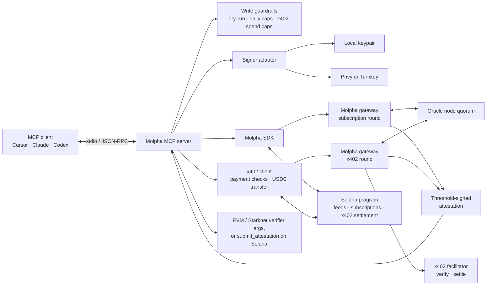

# Molpha MCP

[](https://github.com/molpha/mcp/actions/workflows/ci.yml)
[](LICENSE)
[](package.json)

A [Model Context Protocol (MCP)](https://modelcontextprotocol.io/) server that lets AI agents fetch signed [Molpha](https://docs.molpha.io/) oracle data, publish it on Solana, and build verifier calldata for EVM and Starknet.

Molpha turns HTTP API responses into threshold-signed payloads that can be verified on Solana, EVM, and Starknet. This server exposes that workflow as a small set of MCP tools and keeps signing behind a local, Privy, or Turnkey-backed wallet.

> [!WARNING]
> This release targets Solana Devnet and Sepolia verifier networks. Treat it as testnet software, not a production security boundary. Write tools spend SOL, and round tools may consume subscription quota or pay USDC for x402 rounds, unless dry-run mode is enabled.

## What you can do

- Discover the active registry, oracle nodes, gateways, and verifier deployments.
- Derive a source's `sourceId` locally from a declarative API spec — no transaction, wallet, or subscription required.
- Run a threshold-signing round and build verifier arguments for multiple chains, paid for either by an active USDC subscription or a self-funded [x402](#x402-pay-per-request) round.
- Build EVM/Starknet verifier call args, or submit a signed attestation to a Solana feed.
- Use a local keypair, Privy server wallet, or Turnkey wallet without changing the MCP tool surface, or run the [hosted HTTP server](#hosted-http-mode), which holds no key and has your own wallet sign: one [Sign-In-With-X message](#sign-in-with-your-wallet-siwx) opens a session for subscription rounds.
- Put daily caps and a global dry-run default around agent-initiated writes and x402 spend.

## MCP tools

| Tool | Access | Description |
| --- | --- | --- |
| `get_capabilities` | Read | Return the program id, registry version, node set, gateways, chains, verifier metadata, x402 caps, and whether (and under what limits) this server can pay a paywalled source. |
| `derive_source_id` | Read, local | Derive the `sourceId` for an `apiConfig` locally (see [How sourceId is derived](#how-sourceid-is-derived)). No transaction, no wallet. |
| `describe_feed` | Read | Read the Solana feed for `(sourceId, signaturesRequired, submitter)` and the signer's subscription status. Pass `sourceId`, or `apiConfig` to derive it. |
| `get_latest_value` | Read | Read the latest attested value stored in a Solana feed account. |
| `describe_access` | Read | Read from chain whether a wallet is a subscription owner or a delegate (pass `owner`), with the plan's term, round and quorum limits and the delegate's own round limit. |
| `get_x402_status` | Read | Quote the next x402 round, show where payment goes and the gateway's pending tickets, and read a payer's USDC balance (the signer's unless `payer` is given) and the remaining daily x402 budget. |
| `list_providers` | Read | List the data providers the gateway integrates (for example TickerLayer) and the access flows it serves for each. See [Integrated providers](#integrated-providers). |
| `get_provider` | Read | Describe one provider: its flows, required aggregation, disclosure and ready-made feeds, each with a complete `apiConfig` and its `sourceId`. |
| `quote_source_payment` | Read | Read the price of a paywalled source with one unpaid request: price per fetch, network, payee, the nodes that will fetch, the **worst-case total**, and whether this server would pay it. |
| `execute_subscription_round` | Spends quota (and USDC, if `sourcePayment` is set) | Run a signing round paid from the signer's USDC subscription; return the signed attestation plus verifier arguments. `autoSubmit: true` settles the Solana leg in the same call. `sourcePayment.maxSpendUsdc` authorizes paying a paywalled source, capped. |
| `execute_x402_round` | Spends USDC | Run a signing round paid per request over x402; return the signed attestation plus verifier arguments. `autoSubmit: true` settles the Solana leg in the same call. |
| `build_verifier_calldata` | Read, local | Build EVM/Starknet verifier address and `verify()` call arguments. Calldata only: it verifies nothing. |
| `submit_attestation` | Write | Submit a signed attestation to Solana. Accepts a round tool's output unmodified. |

`build_verifier_calldata` stops at calldata **by design**: the Molpha verifier is stateless, so the agent executes `verify()` itself and the server never submits an EVM/Starknet transaction or vouches for a result it did not verify on-chain. Solana is the one leg this server settles — via `submit_attestation` or a round tool's `autoSubmit` — and there is no standalone Solana verify-simulation path; submit, then read the result back with `get_latest_value`.

`submit_attestation` and `build_verifier_calldata` take a round tool's response as-is: no field remapping between calls, and short hex fields (the gateway emits a one-signer `signersBitmap` as `"4"`) are zero-padded to their canonical widths server-side.

Solana feed accounts are keyed by `(sourceId, signaturesRequired, submitter)`: every wallet that submits a source maintains its own feed for it, created by that wallet's first `submit_attestation`. `describe_feed` and `get_latest_value` default `submitter` to this server's signer; pass another wallet's address to read the feed it maintains.

### Structured output and annotations

Every tool declares an `outputSchema` and returns its result as `structuredContent`, with the same JSON in a text block for clients that do not read structured content. The round tools' `value`, `fresh`, `dataUpdate`, and `signature` fields follow one canonical signed-artifact schema — the same shape `submit_attestation` and `build_verifier_calldata` accept — so a round's output passes to either without remapping. If a result ever fails to match its schema, the tool still returns it in full, flagged as an error, rather than dropping it — so a schema mismatch cannot discard a paid round's signed artifact.

Each tool also carries MCP annotations, so clients can decide what needs confirmation:

| Tool | `readOnlyHint` | `destructiveHint` | `idempotentHint` | `openWorldHint` |
| --- | --- | --- | --- | --- |
| `get_capabilities`, `describe_feed`, `get_latest_value`, `describe_access`, `get_x402_status`, `list_providers`, `get_provider`, `quote_source_payment` | `true` | — | — | `true` |
| `derive_source_id`, `build_verifier_calldata` | `true` | — | — | `false` |
| `execute_subscription_round`, `execute_x402_round` | `false` | `true` | `false` | `true` |
| `submit_attestation` | `false` | `false` | `true` | `true` |

The round tools are marked destructive because each call irreversibly spends subscription quota or USDC, and a repeated call pays for another round. `submit_attestation` only ever advances the signer's own feed: the program accepts an attestation only if it is newer than the one the feed holds, so resubmitting the same payload changes nothing.

### How sourceId is derived

A source is identified by its API config alone — not by the quorum or the signer — and the same `sourceId` identifies it on Solana, EVM, and Starknet:

```text
sourceId      = keccak256(canonicalJson)
canonicalJson = compact JSON of { url, method, headers, responseParser, valueTransform },
                keys in exactly that order, with defaults method = "GET", headers = {},
                valueTransform = "", and header names sorted
```

Median tolerance mode adds a final `aggregation` key (see [Tolerance mode](#tolerance-mode)); exact-mode configs omit it and keep their existing `sourceId`s.

The SDK, gateway, and nodes all derive it this way. It is **not** RFC 8785 (JCS): JCS sorts the top-level keys, which hashes to a different id. Call `derive_source_id` rather than hashing client-side — one differing byte (key order, whitespace, a missing default, header order) produces a `sourceId` that points at the wrong feed and fails verification. The tool returns `canonicalJson` so the preimage can be audited.

### Tolerance mode

By default nodes must fetch a byte-identical value to co-sign. For a live-drifting source, set `apiConfig.aggregation` to let the nodes sign the **median** of their fresh observations instead:

```json
"aggregation": {
  "mode": "tolerance",
  "rule": "median",
  "maxDeviationBps": 50,
  "maxAgeMs": 2000,
  "numeric": { "type": "int256", "decimals": 8 }
}
```

- `aggregation` is part of the `sourceId`, so a source's tolerance settings cannot change without changing its identity. Omit it for exact mode; `"mode": "exact"` is rejected because writing it would change the identity.
- The round needs `signaturesRequired >= 3`; the tools refuse fewer before contacting a gateway or paying.
- The transformed value is parsed as a decimal, scaled by `10^decimals` (round half to even) and signed as a **signed int256**: a two's-complement `bytes32`. Decode it with the same `decimals`; the feed account stores those 32 bytes verbatim. Leave `valueTransform` empty in this mode: it runs on each node before scaling, and a `multiply:` transform truncates to an integer first (`100.125` would sign as `100`).
- Nodes exchange signed round-1 observations (up to about 5 seconds), drop values more than `maxDeviationBps` from the lower median, rank the survivors, and the first `signaturesRequired` of them sign. A round fails when too few survivors remain.

## Quick start

<!-- molpha:generated:quick-start -->
Needs Node.js 24 or later. Nothing to clone or build.

**1. Look around, no wallet.** Read-only: capabilities, providers, `sourceId`s, prices, feed values.

```sh
claude mcp add molpha -- npx -y @molpha/mcp@0.2.0 --read-only
```

**2. Build with a testnet wallet.** Put your signer settings in a `.env` file (see [Configure a signer](#configure-a-signer)), then check them. The doctor prints a ready-to-paste config for your client, with secrets left as placeholders:

```sh
npx -y @molpha/mcp@0.2.0 doctor
```

A config like this keeps every write a preview (`MOLPHA_DRY_RUN=true`):

```sh
claude mcp add molpha -e SIGNER_BACKEND=keychain -e KEYCHAIN_BACKEND=privy -e PRIVY_APP_ID='<privy-app-id>' -e PRIVY_APP_SECRET='<privy-app-secret>' -e PRIVY_WALLET_ID='<privy-wallet-id>' -e PRIVY_WALLET_ADDRESS='<base58-solana-address>' -e MOLPHA_DRY_RUN=true -- npx -y @molpha/mcp@0.2.0
```

**3. Spend** only when you mean to: fund the wallet, then set `MOLPHA_DRY_RUN=false` in the server's config. The full guide, with Cursor, VS Code, Codex and Claude Desktop, is [docs/integration.md](docs/integration.md).
<!-- /molpha:generated:quick-start -->

### Requirements

- Node.js 24 or later
- For writes: a Solana wallet funded with Devnet SOL, and Devnet USDC if you plan to use an active subscription or the x402 pay-per-request path
- An MCP client such as Claude Code, Cursor, VS Code, Claude Desktop, or Codex

With no signer configured the server starts **read-only**: it offers only the ten read tools and reports `runLevel: "read-only"` from `get_capabilities`. Pass `--read-only` (or set `SIGNER_BACKEND=none`) to force it even when a signer is configured.

### Configure a signer

For local development, point `OWNER_KEYPAIR` at a Solana JSON keypair. Use an absolute path when an MCP client launches the server, and use a dedicated testnet wallet.

```dotenv
SIGNER_BACKEND=memory
OWNER_KEYPAIR=/absolute/path/to/owner-keypair.json
SOLANA_RPC=https://api.devnet.solana.com
GATEWAY_ENDPOINTS=
GATEWAY_AUTHORITIES=
MOLPHA_DRY_RUN=true
```

The same wallet owns feeds, pays for x402 rounds from its USDC account, authenticates gateway requests, and signs Solana transactions. Do not commit `.env`, wallet files, or credentials.

Gateway request signatures bind the gateway's on-chain PDA, so the server needs each gateway's authority. Set `GATEWAY_AUTHORITIES` to the base58 authority of each `GATEWAY_ENDPOINTS` entry, in the same order. An empty entry makes the SDK discover the authority from the gateway's `GET /v1/info`, which not every gateway serves. The authority must also own an Active on-chain `Gateway` account before this server pays for an x402 round (see [x402 pay-per-request](#x402-pay-per-request)).

Other supported signer configurations:

| Backend | Required configuration |
| --- | --- |
| Local keypair | `SIGNER_BACKEND=memory`, `OWNER_KEYPAIR` |
| Privy | `SIGNER_BACKEND=keychain`, `KEYCHAIN_BACKEND=privy`, `PRIVY_APP_ID`, `PRIVY_APP_SECRET`, `PRIVY_WALLET_ID`, `PRIVY_WALLET_ADDRESS` |
| Turnkey | `SIGNER_BACKEND=keychain`, `KEYCHAIN_BACKEND=turnkey`, `TURNKEY_API_PUBLIC_KEY`, `TURNKEY_API_PRIVATE_KEY`, `TURNKEY_ORGANIZATION_ID`, `TURNKEY_WALLET_ADDRESS` |
| None (read-only) | `SIGNER_BACKEND=none`, or no signer settings at all |

The Privy and Turnkey SDKs are optional dependencies of `@molpha/mcp`, installed with it by default. If you installed with `--omit=optional`, add the provider you use next to the server:

```bash
npm install @privy-io/node          # KEYCHAIN_BACKEND=privy
npm install @turnkey/sdk-server @turnkey/solana   # KEYCHAIN_BACKEND=turnkey
```

See [.env.example](.env.example) and the ready-to-edit files in [examples](examples) for every backend.

### Dry-run lock

`MOLPHA_DRY_RUN=true` locks the write tools (`execute_subscription_round`, `execute_x402_round`, `submit_attestation`) to previews. A call that passes `dryRun: false` is refused with `dry_run_locked`, so going live is a change to the server's config, never to one tool call. Unset, the default is live and a call may pass `dryRun: true` to preview.

### Check the setup

From the folder that holds your `.env`:

<!-- molpha:generated:doctor -->
```sh
npx -y @molpha/mcp@0.2.0 doctor
```
<!-- /molpha:generated:doctor -->

The doctor checks the signer configuration, wallet availability, Solana RPC and gateway. It then prints a config for each client with `MOLPHA_DRY_RUN=true`, leaving secrets as placeholders. If your settings came from an env file, the config points at that file instead of copying its values.

### Bootstrap a subscription

Subscription operations debit USDC, so they are deliberately kept out of the MCP tool surface. Run the provisioning command once with the same signer configuration used by the server:

<!-- molpha:generated:provision -->
```sh
npx -y @molpha/mcp@0.2.0 provision subscribe --plan Basic --max-price-usdc 20000000 --dry-run
```
<!-- /molpha:generated:provision -->

`--max-price-usdc` is a safety cap in raw USDC base units (6 decimals), not a quoted plan price. The transaction aborts if the live on-chain price exceeds the cap. Drop `--dry-run` to subscribe, or replace `subscribe` with `extend` to extend an existing subscription.

### Connect an MCP client

The server speaks stdio JSON-RPC. Every client launches it with `npx`; the snippets are in [docs/integration.md](docs/integration.md) for Claude Code, Cursor, VS Code, Codex and Claude Desktop, and the doctor prints them for your own settings. Ready-to-edit copies live in [examples](examples) (`cursor-*.mcp.json`, `codex-*.toml`).

#### Claude Desktop (MCPB)

From the first release that includes it, each GitHub release attaches `molpha-mcp.mcpb`, an [MCP Bundle](https://github.com/modelcontextprotocol/mcpb) built by CI from an allowlist of the published package's files. Install it by double-clicking the file, dragging it into the Claude Desktop window, or Settings → Extensions → Advanced settings → Install Extension…. During install, choose the signer (local keypair path, Privy, or Turnkey); leave it empty for read-only. `Dry run` defaults to on.

To build a bundle yourself, see [Development](#development).

## Example prompts

Once the server is connected, these prompts exercise the main workflows.

### Discover the network

> Use Molpha to inspect the current oracle capabilities. Summarize the registry version, node count, supported chains, gateway endpoints, and verifier addresses. Do not make any writes.

### Preview a source

> Derive a Molpha sourceId for `https://api.example.com/v1/finalized/price` using the JSON path `$.price`. Show me the canonical JSON, the derived sourceId, and any determinism warnings. Do not send a transaction.

Replace the example URL with a public endpoint that returns stable, independently reproducible data. Live ticker endpoints may produce different values across oracle nodes and fail to reach quorum.

### Fetch a signed result

> For that same source, run a subscription round with 3 required signatures and a maximum age of 60 seconds, for the EVM chain. Summarize the signed value, timestamp, registry version, quorum, and EVM verifier call. Treat the signed attestation as the trust anchor; do not trust the value by itself.

### Find and run a provider's feed

> List the integrated data providers. Describe TickerLayer's `btcusd` feed on the `api_key` flow, then run it with 3 required signatures for Solana, passing the `apiConfig` exactly as given. Report the signed value as an attested provider quote and settle it on Solana.

### Price a paid source before paying

> Describe TickerLayer's `btcusd` feed on the `x402` flow and call `quote_source_payment` for it with 3 signatures. Tell me the price per fetch, how many nodes will be paid, and the worst case. Then run it authorizing exactly that worst case, and tell me what was paid.

### Check x402 spend before paying

> Call `get_x402_status` for 3 required signatures. Tell me the quoted next price, where the payment goes, and my USDC balance before I authorize an `execute_x402_round`.

### Publish with an approval checkpoint

> Read the latest value for Molpha source `<SOURCE_ID>` at 3 required signatures. If I provide a newer signed attestation, preview `submit_attestation` with `dryRun: true`, explain the fee-paying wallet and exact write, and wait for my confirmation before submitting it to Solana.

## Architecture


```mermaid
flowchart LR
    Client["MCP client<br/>Cursor · Claude · Codex"] <-->|"stdio / JSON-RPC"| Server["Molpha MCP server"]
    Server --> Guardrails["Write guardrails<br/>dry-run · daily caps · x402 spend caps"]
    Server --> Signer["Signer adapter"]
    Signer --> Memory["Local keypair"]
    Signer --> Keychain["Privy or Turnkey"]
    Server --> SDK["Molpha SDK"]
    Server --> X402["x402 client<br/>payment checks · USDC transfer"]
    SDK --> Gateway["Molpha gateway<br/>subscription round"]
    X402 --> Gateway2["Molpha gateway<br/>x402 round"]
    Gateway2 --> Facilitator["x402 facilitator<br/>verify · settle"]
    Gateway <--> Nodes["Oracle node quorum"]
    Gateway2 <--> Nodes
    SDK <--> Solana["Solana program<br/>feeds · subscriptions · x402 settlement"]
    X402 <--> Solana
    Gateway --> Artifact["Threshold-signed<br/>attestation"]
    Gateway2 --> Artifact
    Artifact --> Server
    Server --> Args["EVM / Starknet verifier args,<br/>or submit_attestation on Solana"]
```

The server is an adapter and policy boundary, not a new source of truth:

1. The MCP client invokes a typed tool over stdio.
2. The signer authenticates gateway requests and owner transactions.
3. Oracle nodes independently fetch the committed API configuration and produce one aggregate signature after reaching quorum.
4. The server returns the self-contained signed artifact. Solana can verify or store it; EVM and Starknet consumers receive contract-ready verifier arguments.
5. Consumers trust a value only after verifying the signed payload against its registry version.

Provisioning is a separate CLI path because subscribing or extending debits USDC. It is never available to an autonomous MCP tool call.

## Configuration

| Variable | Default | Purpose |
| --- | --- | --- |
| `SIGNER_BACKEND` | `memory` | `memory` or `keychain` |
| `KEYCHAIN_BACKEND` | — | `privy` or `turnkey` for a keychain signer |
| `OWNER_KEYPAIR` | — | Local Solana JSON keypair path |
| `SOLANA_RPC` | `https://api.devnet.solana.com` | Solana RPC endpoint |
| `GATEWAY_ENDPOINTS` | `https://dev-gateway.molpha.io` | Comma-separated **Molpha gateway** base URLs (not your Solana RPC). Must expose `/v1/nodes` and signing routes (`/v1/x402/execute` for x402, `/v1/round/execute` for subscription). Run `molpha-mcp doctor` to verify. |
| `GATEWAY_AUTHORITIES` | — | Comma-separated base58 gateway authorities, one per `GATEWAY_ENDPOINTS` entry in the same order. Bound into request signatures; required for gateways that do not serve `GET /v1/info`. |
| `MOLPHA_EVM_NETWORKS` | `evm-sepolia` | Comma-separated EVM verifier networks |
| `MOLPHA_STARKNET_NETWORKS` | `starknet-sepolia` | Comma-separated Starknet verifier networks |
| `MOLPHA_MAX_EXECUTES_PER_DAY` | `100` | Process-local daily Solana-submit cap |
| `MOLPHA_DRY_RUN` | `false` | Preview all writes when set to `true` |
| `MOLPHA_X402_MAX_PRICE_USDC` | `1` | Refuse to pay for an x402 round priced above this (decimal USDC) |
| `MOLPHA_X402_MAX_SPEND_PER_DAY_USDC` | `10` | Process-local daily cap on USDC signed for x402 rounds (decimal USDC) |
| `MOLPHA_SOURCE_PAYER_KEY` | — | Hex private key of the **EVM** wallet that pays paywalled sources. Never printed or returned by a tool. Source payment stays off without it. See [Integrated providers](#integrated-providers). |
| `MOLPHA_SOURCE_PAYMENT_NETWORKS` | — | Comma-separated CAIP-2 networks a source may be paid on, e.g. `eip155:84532` (Base Sepolia). Empty keeps source payment off, even with a key. |
| `MOLPHA_SOURCE_MAX_PER_ROUND_USDC` | `0.25` | Refuse a round whose worst case (price per fetch × the nodes that may fetch) exceeds this (decimal USDC) |
| `MOLPHA_SOURCE_MAX_SPEND_PER_DAY_USDC` | `1` | Process-local daily cap on USDC committed to paying sources (decimal USDC) |

The daily counters are process-local and reset when the server restarts. They are safety rails, not durable rate limits.

## x402 pay-per-request

Each way of paying for a round has its own tool:

- `execute_subscription_round` — use the signer's active USDC subscription (see [Bootstrap a subscription](#bootstrap-a-subscription)). Fails if the subscription is inactive or out of quota.
- `execute_x402_round` — pay for the round itself with an [x402](https://github.com/x402-foundation/x402) `exact` payment on Solana, with no subscription required. The signer transfers the round price in USDC to the protocol treasury (the USDC account of the `ProtocolConfig` PDA); the gateway's facilitator pays the network fee.

A paid round works like this:

1. The server requests the round without payment. The gateway answers `402 Payment Required` with its payment requirements.
2. The server treats those requirements as untrusted and signs nothing unless every one matches what it derives itself:
   - `payTo` is the protocol treasury: the `ProtocolConfig` PDA derived from the program id, never the gateway. The round's gateway is the `GATEWAY_AUTHORITIES` entry for that endpoint, or the authority from `GET /v1/info`, which must own an Active on-chain `Gateway` account.
   - `asset` is the USDC mint in the on-chain `ProtocolConfig`.
   - `amount` is the protocol price, `x402_round_base + (signaturesRequired + redundancy_buffer) × reward_per_signature`, within `MOLPHA_X402_MAX_PRICE_USDC` and the rest of today's `MOLPHA_X402_MAX_SPEND_PER_DAY_USDC`.
   - `network` is the cluster `SOLANA_RPC` points at.
   - `extra.memo` is this round's commitment to the program, gateway, source, quorum, registry version, and timestamp.
   - `extra.feePayer` is an account other than the signer.
3. The server signs a USDC `TransferChecked` from the signer's token account and repeats the request with the payment in the `PAYMENT-SIGNATURE` header. The gateway verifies the payment before it dispatches the round and settles it before it returns data. The tool result includes a `paymentReceipt` with the settlement transaction.

The daily cap counts every payment the server signs, whether or not its round completes, because a signed transfer can settle until its blockhash expires. When the gateway rejects a payment, the tool fails without paying again. When the gateway's answer leaves the outcome unknown (a 5xx, or a dropped connection after the payment was sent), the tool fails with `payment_outcome_unknown` and the payment's memo; look for that memo in the signer's USDC account before paying for the round again.

Call `get_x402_status` before spending. It returns the quoted price for a quorum, where payment goes (the protocol treasury) and the gateway's pending tickets, the signer's USDC balance, and the remaining daily budget. With `dryRun: true`, `execute_x402_round` quotes and verifies the payment and reports the signer's balance without signing anything. Private API secrets (`encryptSecrets`) are only supported by `execute_subscription_round`.

## Integrated providers

A gateway can integrate data providers; [TickerLayer](https://tickerlayer.com) market data is the first. A provider is a descriptor on the gateway (not on-chain state): it lists the access flows the gateway can serve and **ready-made feeds**, each with a complete `apiConfig` and its `sourceId`. Three tools expose it:

| Tool | What it does |
| --- | --- |
| `list_providers` | The providers the gateway integrates and the flows it serves for each now. |
| `get_provider` | One provider's flows, required aggregation, disclosure and feeds. Narrow with `flow` and `feed`. |
| `quote_source_payment` | One unpaid request to a paywalled source: price per fetch, network, payee, the nodes that will fetch, and the **worst case**, plus whether this server would pay it. |

There are two ways to get a provider's data, and an agent chooses by what `get_provider` says each flow is:

- **`api_key` — you pay nothing and send nothing.** The gateway operator holds the provider key. Pass the feed's `apiConfig`, unchanged, to `execute_subscription_round` with `signaturesRequired` of at least 3 (provider feeds use median tolerance aggregation). Do not add headers or a key to it: any change moves the `sourceId` and, on the provider's host, is refused by the gateway.
- **`x402` — you pay the provider, per node fetch.** Every node that fetches is paid for, so a round costs price × the nodes that may fetch. Call `quote_source_payment`, then run the feed with `sourcePayment: { maxSpendUsdc }` on `execute_subscription_round`.

The credential or payment never enters the `apiConfig`, so the `sourceId` — the feed's identity — is the same whoever pays. Describe a provider's values as **attested provider quotes**: Molpha attests what the endpoint returned by threshold signature, not that the price is correct (`get_provider` returns the provider's own `disclosure`).

### Paying a source

Paying is **off by default**. It needs both a payer wallet and an explicit network allowlist on the server:

```dotenv
MOLPHA_SOURCE_PAYER_KEY=0x…                     # an EVM key; never printed or returned
MOLPHA_SOURCE_PAYMENT_NETWORKS=eip155:84532     # Base Sepolia; add eip155:8453 only deliberately
MOLPHA_SOURCE_MAX_PER_ROUND_USDC=0.25
MOLPHA_SOURCE_MAX_SPEND_PER_DAY_USDC=1
```

What stops an agent paying more than it meant to:

1. **Opt-in per call.** A paywalled source called without `sourcePayment` is never paid: the call fails with `source_payment_required` and the quote.
2. **The price is read first, from the source itself,** and the worst case is checked against what you authorized in `sourcePayment.maxSpendUsdc`, the per-round cap and the daily cap **before anything is signed**. A refusal (`source_payment_refused`) signs and pays nothing.
3. **The vetted terms are what gets signed,** so the price cannot move between the check and the payment.
4. **The network must be allowlisted.** A source asking to be paid elsewhere is refused.
5. **No automatic retry once signing starts.** A retry would sign a fresh set of authorizations, and the caps cover exactly one.
6. **The spend is counted when committed,** not when it settles: a signed authorization can settle whether or not the round completes. Concurrent calls cannot all pass a cap that only one fits under.
7. **The key stays in the server.** It is not in any output, error or log, and the hosted HTTP server never loads one (it holds no wallet).

The payer pays the source directly; Molpha never receives it. Only authorizations the nodes actually spend settle, so the exact charge is visible in the payer's balance. Source payment is for public sources: it cannot be combined with `encryptSecrets`.

## Development

Clone and build from source:

```bash
git clone https://github.com/molpha/mcp.git
cd mcp
npm ci
cp .env.example .env
npm run build
```

Point a client at the built server with `node /absolute/path/to/mcp/dist/src/server.js` instead of the `npx` command.

```bash
npm run dev        # start from TypeScript for local development
npm run typecheck  # validate types without emitting files
npm test           # run the Vitest suite
npm run build      # compile src/, cli/, and tests into dist/
npm run gen:install  # rewrite the install snippets in the docs and examples
npm run smoke:pack   # pack the tarball and run it with npx over stdio (needs network)
npm run pack:mcpb    # build the Claude Desktop bundle from an allowlist (writes molpha-mcp.mcpb)
```

`@molpha/sdk` is pinned to an exact version in `package.json` and resolved from the npm registry. To try a local SDK checkout, run `npm install ../sdk` here and do not commit the result.

Install snippets (the README quick start, `docs/integration.md`, `examples/`) are generated from `src/install-config.ts` and the version the next release will have. Edit the renderers, not the generated text; `npm test` fails when a generated file is out of date.

Before opening a pull request, run:

```bash
npm run typecheck && npm test && npm run build
```

Bug reports and focused pull requests are welcome. For security issues, use [GitHub's private vulnerability reporting](https://github.com/molpha/mcp/security/advisories/new) instead of a public issue.

## Releasing

Versioning and publishing are automated with [Changesets](https://github.com/changesets/changesets). If your pull request changes published behavior, add a changeset:

```bash
npx changeset
```

This records the bump type (patch/minor/major) and a changelog entry. On merge to `main`, [.github/workflows/release.yml](.github/workflows/release.yml):

1. Opens or updates a "Version Packages" pull request that bumps `package.json`, `manifest.json`, and `server.json` in lockstep and updates `CHANGELOG.md`.
2. When that PR is merged, publishes `@molpha/mcp` to npm using [trusted publishing](https://docs.npmjs.com/trusted-publishers) (GitHub Actions OIDC — no npm token in CI), then publishes `server.json` to the [MCP registry](https://registry.modelcontextprotocol.io/) using `mcp-publisher` with GitHub OIDC login.

No secrets are needed for either publish step; both rely on the workflow's `id-token: write` permission and are authorized via each registry's trust relationship with this repository.

## Documentation

- [Molpha protocol documentation](https://docs.molpha.io/)
- [Integration guide](docs/integration.md): install per client, and [signing in with your own wallet (SIWX)](docs/integration.md#4-sign-in-with-your-own-wallet-siwx)
- [Client configuration examples](examples)
- [MCPB manifest](manifest.json) for Claude Desktop / `.mcpb` packaging
- [Hosted HTTP mode](docs/hosted-http.md)

## License

Released under the [MIT License](LICENSE).

## Hosted HTTP mode

Run `molpha-mcp --http --port 8402` to serve stateless Streamable HTTP at `/mcp`, with health checks at `/healthz`. Stdio remains the default.

The hosted server is **keyless**: it holds no signer and accepts no credentials, and a client is configured with nothing but the URL. Anything that needs a signature is returned for the caller's own wallet to sign, so each such operation is two tool calls around one signature:

| Operation | Hosted tools | The wallet signs |
| --- | --- | --- |
| Subscription round | `begin_session` → `complete_session` → `execute_subscription_round` | A text message, once per session |
| x402 round | `prepare_x402_round` → `execute_x402_round` | A USDC transfer, not broadcast |
| Solana submit | `prepare_submit_attestation` → `send_signed_transaction` | The submit transaction |

The stdio tools `submit_attestation` and the one-call round tools are not offered over HTTP, and neither are `autoSubmit`, `dryRun` or `encryptSecrets`. Hosted defaults retain the per-round price ceiling, disable shared daily budgets, and rate-limit requests per IP; set spending limits in the wallet's own policy, and use local stdio for private API work. The prepare tools need `MOLPHA_HTTP_CHALLENGE_SECRET` on the server.

### Sign in with your wallet (SIWX)

A local stdio server authenticates subscription rounds with the signer it holds. The hosted server holds none, so a subscription round is authorized by a **sign-in session** instead: the wallet signs one Sign-In-With-X text message (the x402 `sign-in-with-x` extension, in its Solana form), and the gateway issues a short-lived bearer token. The message is not a transaction and moves no funds.

| Step | Call | Result |
| --- | --- | --- |
| 1 | `describe_access({ address, owner? })` | Whether the wallet is a subscription `owner` or `delegate`, and its limits |
| 2 | `begin_session({ address, owner? })` | The `message` to sign and an opaque `challenge` |
| 3 | The wallet signs `message` | An Ed25519 signature over its exact UTF-8 bytes |
| 4 | `complete_session({ challenge, signature })` | A `sessionToken` and its `expiresAt` |
| 5 | `execute_subscription_round({ sessionToken, apiConfig, signaturesRequired, chains })` | The signed attestation and verifier arguments |

- **Who can sign in.** The subscription owner, or a delegate the owner added with the program's `add_delegate` instruction. A delegate passes the owner's address as `owner`.
- **What is signed.** The message names the gateway, its on-chain PDA, the program and the subscription owner, and expires in about five minutes. The server refuses a gateway challenge that does not state its own configured terms, so it never hands a wallet text for another gateway or chain.
- **How to sign.** The message as returned: raw UTF-8, no prefix, no envelope, no trailing newline. The signature may be base58, base64 or hex. `solana sign-offchain-message` wraps the text and is refused with `invalid_signature`.
- **What the token is.** A credential scoped to one wallet and one gateway, valid for 30 minutes by default and never past the subscription term. It only identifies the caller: the gateway re-reads the subscription and delegate from chain for every round, so `remove_delegate` ends access whatever tokens exist. It passes through this server on each round call and is never stored, cached or logged here.
- **What it needs.** A gateway with sessions enabled: `GET /v1/info` reports `sessionAuth: true`. Otherwise `begin_session` answers `sessions_unavailable`, and x402 rounds remain available.

The walkthrough, with a signing example, delegate setup, error codes and the gateway's own session routes, is in [docs/integration.md](docs/integration.md#4-sign-in-with-your-own-wallet-siwx).

See [hosted HTTP configuration, client examples, and deployment runbook](docs/hosted-http.md). The container is deployment-ready; public deployment and `server.json` remote registration are separate launch steps.
