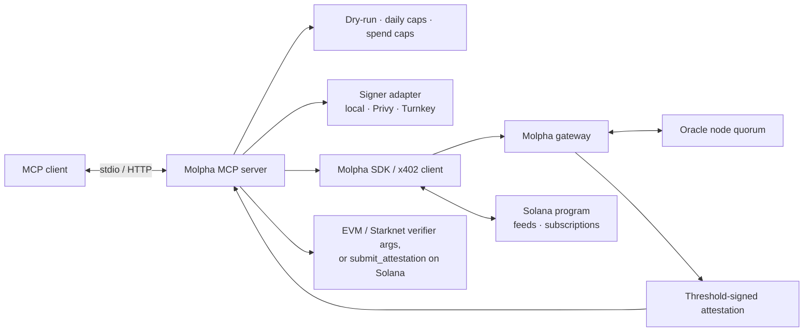

# Molpha MCP

[](https://github.com/molpha/mcp/actions/workflows/ci.yml)
[](LICENSE)
[](package.json)

A [Model Context Protocol (MCP)](https://modelcontextprotocol.io/) server that lets AI agents fetch signed [Molpha](https://docs.molpha.io/) oracle data, publish it on Solana, and build verifier calldata for EVM and Starknet.

Molpha turns HTTP API responses into threshold-signed payloads that can be verified on Solana, EVM, and Starknet. This server exposes that workflow as MCP tools, with signing behind a local, Privy, or Turnkey wallet, or, on `mcp.molpha.io`, behind your own wallet.

> [!WARNING]
> This release targets Solana Devnet and Sepolia verifier networks. Treat it as testnet software, not a production security boundary. Write tools spend SOL, and round tools may consume subscription quota or pay USDC for x402 rounds, unless dry-run mode is enabled.

## Quick start

Two recommended ways to connect:

| | [mcp.molpha.io](#mcpmolphaio) | [Local (stdio)](#local-stdio) |
| --- | --- | --- |
| Install | Nothing: add the URL to your client | `npx`, Node.js 24 or later |
| Signer | Your own wallet. The server holds no key. | Local keypair, Privy or Turnkey, held by the server |
| Subscription rounds | [Sign in with SIWX](#sign-in-with-your-wallet-siwx), then `execute_subscription_round` | `execute_subscription_round` |
| Spending limits | Your wallet's own policy | Dry-run lock and daily caps in the server |
| Best for | Getting started, agents that bring their own wallet | Unattended agents, private API sources |

### mcp.molpha.io

Nothing to install, and no keys to hand over. Add the URL to your client.

Claude Code:

```sh
claude mcp add --transport http molpha https://mcp.molpha.io/mcp
```

Cursor (`.cursor/mcp.json`):

```json
{ "mcpServers": { "molpha": { "url": "https://mcp.molpha.io/mcp" } } }
```

The read tools work straight away. The server has no wallet of its own, so name the one you mean: `submitter` for `describe_feed` and `get_latest_value`, `payer` for `get_x402_status`.

Anything that needs a signature is returned for your own wallet to sign, so each such operation is two or three tool calls around one signature:

| Operation | Tools, in order | The wallet signs |
| --- | --- | --- |
| Subscription round | `begin_session` → `complete_session` → `execute_subscription_round` | A text message, once per session |
| x402 round | `prepare_x402_round` → `execute_x402_round` | A USDC transfer, not broadcast |
| Solana submit | `prepare_submit_attestation` → `send_signed_transaction` | The submit transaction |

`autoSubmit`, `dryRun` and `encryptSecrets` are not offered here. Set spending limits in the wallet's own policy, and use the local server for private API work.

#### Sign in with your wallet (SIWX)

A subscription round on `mcp.molpha.io` is authorized by a **sign-in session**: the wallet signs one Sign-In-With-X text message (the x402 `sign-in-with-x` extension, in its Solana form), and the gateway issues a short-lived bearer token. The message is not a transaction and moves no funds.

| Step | Call | Result |
| --- | --- | --- |
| 1 | `describe_access({ address, owner? })` | Whether the wallet is a subscription `owner` or `delegate`, and its limits |
| 2 | `begin_session({ address, owner? })` | The `message` to sign and an opaque `challenge` |
| 3 | The wallet signs `message` | An Ed25519 signature over its exact UTF-8 bytes |
| 4 | `complete_session({ challenge, signature })` | A `sessionToken` and its `expiresAt` |
| 5 | `execute_subscription_round({ sessionToken, apiConfig, signaturesRequired, chains })` | The signed attestation and verifier arguments |

- **Who can sign in.** The subscription owner, or a delegate the owner added with `add_delegate`. A delegate passes the owner's address as `owner`.
- **How to sign.** The message as returned: raw UTF-8, no prefix, no envelope, no trailing newline. The signature may be base58, base64 or hex. `solana sign-offchain-message` wraps the text and is refused with `invalid_signature`.
- **What the token is.** A credential for one wallet and one gateway, valid 30 minutes by default and never past the subscription term. It only identifies the caller: the gateway re-reads the subscription and delegate from chain on every round, so `remove_delegate` ends access whatever tokens exist. It passes through this server and is never stored or logged.
- **What it needs.** A gateway with `sessionAuth: true` in `GET /v1/info`. Otherwise `begin_session` answers `sessions_unavailable` and x402 rounds remain available.

The full walkthrough, with a signing example, delegate setup, gateway routes and error codes, is in [docs/integration.md](docs/integration.md#4-sign-in-with-your-own-wallet-siwx).

### Local (stdio)

The server runs on your machine and holds the signer, so one tool call runs a round or submits to Solana, and `MOLPHA_DRY_RUN` keeps every write a preview until you turn it off.

<!-- molpha:generated:quick-start -->
Needs Node.js 24 or later. Nothing to clone or build.

**1. Look around, no wallet.** Read-only: capabilities, providers, `sourceId`s, prices, feed values.

```sh
claude mcp add molpha -- npx -y @molpha/mcp@0.2.0 --read-only
```

**2. Build with a testnet wallet.** Put your signer settings in a `.env` file (see [Setup](#setup)), then check them. The doctor prints a ready-to-paste config for your client, with secrets left as placeholders:

```sh
npx -y @molpha/mcp@0.2.0 doctor
```

A config like this keeps every write a preview (`MOLPHA_DRY_RUN=true`):

```sh
claude mcp add molpha -e SIGNER_BACKEND=keychain -e KEYCHAIN_BACKEND=privy -e PRIVY_APP_ID='<privy-app-id>' -e PRIVY_APP_SECRET='<privy-app-secret>' -e PRIVY_WALLET_ID='<privy-wallet-id>' -e PRIVY_WALLET_ADDRESS='<base58-solana-address>' -e MOLPHA_DRY_RUN=true -- npx -y @molpha/mcp@0.2.0
```

**3. Spend** only when you mean to: fund the wallet, then set `MOLPHA_DRY_RUN=false` in the server's config. The full guide, with Cursor, VS Code, Codex and Claude Desktop, is [docs/integration.md](docs/integration.md).
<!-- /molpha:generated:quick-start -->

With no signer configured the server starts **read-only** and offers only the read tools (`runLevel: "read-only"` in `get_capabilities`). `--read-only` or `SIGNER_BACKEND=none` forces it.

## Tools

| Tool | Access | Description |
| --- | --- | --- |
| `get_capabilities` | Read | Run level, program id, registry version, nodes, gateways, chains, verifier addresses, x402 caps and source-payment policy. |
| `derive_source_id` | Read, local | Derive an `apiConfig`'s `sourceId` ([how](docs/reference.md#how-sourceid-is-derived)). No transaction, no wallet. |
| `describe_feed` | Read | Read the Solana feed for `(sourceId, signaturesRequired, submitter)` and the signer's subscription status. |
| `get_latest_value` | Read | Read the latest attested value stored in a Solana feed account. |
| `describe_access` | Read | Whether a wallet is a subscription owner or delegate, with the plan's and the delegate's limits. |
| `get_x402_status` | Read | Quote the next x402 round, show where payment goes, and read a payer's USDC balance and remaining daily budget. |
| `list_providers` | Read | The data providers the gateway integrates and the flows it serves ([providers](docs/reference.md#integrated-providers)). |
| `get_provider` | Read | One provider's flows, disclosure and ready-made feeds, each with a complete `apiConfig` and `sourceId`. |
| `quote_source_payment` | Read | Price a paywalled source with one unpaid request, including the worst-case total. |
| `execute_subscription_round` | Spends quota | Run a round paid from a USDC subscription; return the signed attestation plus verifier arguments. `autoSubmit: true` settles Solana in the same call. |
| `execute_x402_round` | Spends USDC | Run a round paid per request over [x402](docs/reference.md#x402-pay-per-request); same output. |
| `build_verifier_calldata` | Read, local | Build EVM/Starknet verifier address and `verify()` call arguments. Calldata only: it verifies nothing. |
| `submit_attestation` | Write | Submit a signed attestation to Solana. Accepts a round tool's output unmodified. |

On `mcp.molpha.io` the one-call round and submit tools become prepare/sign/execute pairs ([above](#mcpmolphaio)). Every tool returns `structuredContent` and carries MCP annotations; see [Structured output and annotations](docs/reference.md#structured-output-and-annotations). For tolerance-mode aggregation and the full configuration table, see [docs/reference.md](docs/reference.md).

**Round timing.** Rounds run on a fixed 100 ms tick. Requests for one feed (the same source and quorum) inside one tick share a round, so a feed runs at most 10 rounds per second, and one wallet gets at most one round per tick for a feed: a second request in the same tick is answered with HTTP 409, which the round tools retry a tick later before failing with `round_conflict`. See [Round timing](docs/reference.md#round-timing).

## Setup

For the [local server](#local-stdio).

**Signer.** Put your settings in a `.env` file and check them with the doctor. It prints a ready-to-paste config for your client with secrets left as placeholders. Use a dedicated testnet wallet.

```dotenv
SIGNER_BACKEND=memory
OWNER_KEYPAIR=/absolute/path/to/owner-keypair.json
SOLANA_RPC=https://api.devnet.solana.com
MOLPHA_DRY_RUN=true
```

Privy and Turnkey settings are in [docs/reference.md](docs/reference.md#signers) and [.env.example](.env.example).

<!-- molpha:generated:doctor -->
```sh
npx -y @molpha/mcp@0.2.0 doctor
```
<!-- /molpha:generated:doctor -->

**Dry-run lock.** `MOLPHA_DRY_RUN=true` locks `execute_subscription_round`, `execute_x402_round` and `submit_attestation` to previews. A call with `dryRun: false` is refused with `dry_run_locked`, so going live is a change to the server's config, never to one tool call.

**Subscription.** Subscribing debits USDC, so it is kept out of the MCP tools and runs as a CLI command with the same signer configuration. `--max-price-usdc` is a cap in USDC base units (6 decimals); drop `--dry-run` to subscribe, or use `extend` to extend one.

<!-- molpha:generated:provision -->
```sh
npx -y @molpha/mcp@0.2.0 provision subscribe --plan Basic --max-price-usdc 20000000 --dry-run
```
<!-- /molpha:generated:provision -->

**Client.** Every client launches the local server with `npx`. Snippets for Claude Code, Cursor, VS Code, Codex and Claude Desktop are in [docs/integration.md](docs/integration.md), ready-to-edit copies are in [examples](examples), and Claude Desktop users can install the `molpha-mcp.mcpb` bundle attached to each release.

## Example prompts

> **Discover.** Use Molpha to inspect the current oracle capabilities. Summarize the registry version, node count, chains, gateways, and verifier addresses. Make no writes.

> **Derive.** Derive a Molpha sourceId for `https://api.example.com/v1/finalized/price` using the JSON path `$.price`. Show me the canonical JSON and the sourceId. Do not send a transaction.

> **Fetch.** For that source, run a subscription round with 3 signatures for the EVM chain. Summarize the value, timestamp, registry version and verifier call. Treat the signed attestation as the trust anchor, not the value alone.

> **Provider.** List the integrated data providers, describe TickerLayer's `btcusd` feed, and run it with 3 signatures for Solana, passing the `apiConfig` exactly as given.

> **Check spend.** Call `get_x402_status` for 3 signatures. Tell me the price, where payment goes, and my USDC balance before I authorize an `execute_x402_round`.

> **Publish.** If I give you a newer signed attestation, preview `submit_attestation` with `dryRun: true`, explain the exact write, and wait for my confirmation before submitting.

Use a public endpoint that returns stable, independently reproducible data: live ticker endpoints may differ across oracle nodes and fail to reach quorum.

## How it works


```mermaid
flowchart LR
    Client["MCP client"] <-->|"stdio / HTTP"| Server["Molpha MCP server"]
    Server --> Guardrails["Dry-run · daily caps · spend caps"]
    Server --> Signer["Signer adapter<br/>local · Privy · Turnkey"]
    Server --> SDK["Molpha SDK / x402 client"]
    SDK --> Gateway["Molpha gateway"]
    Gateway <--> Nodes["Oracle node quorum"]
    SDK <--> Solana["Solana program<br/>feeds · subscriptions"]
    Gateway --> Artifact["Threshold-signed attestation"]
    Artifact --> Server
    Server --> Args["EVM / Starknet verifier args,<br/>or submit_attestation on Solana"]
```

The server is an adapter and policy boundary, not a new source of truth. Oracle nodes independently fetch the committed API configuration and produce one aggregate signature after reaching quorum; the server returns that self-contained signed artifact. Consumers trust a value only after verifying the signed payload against its registry version.

## Development

```bash
git clone https://github.com/molpha/mcp.git
cd mcp
npm ci
cp .env.example .env
npm run build
```

Point a client at the built server with `node /absolute/path/to/mcp/dist/src/server.js`.

```bash
npm run dev          # start from TypeScript
npm run typecheck && npm test && npm run build   # run before opening a pull request
npm run gen:install  # rewrite the generated install snippets in the docs and examples
npm run smoke:pack   # pack the tarball and run it with npx over stdio (needs network)
npm run pack:mcpb    # build the Claude Desktop bundle from an allowlist
```

`@molpha/sdk` is pinned to an exact version and resolved from the npm registry; to try a local checkout run `npm install ../sdk` and do not commit the result. Install snippets are generated from `src/install-config.ts`: edit the renderers, not the generated text, because `npm test` fails when a generated file is out of date.

Versioning and publishing use [Changesets](https://github.com/changesets/changesets): if a pull request changes published behavior, run `npx changeset`. On merge to `main`, [release.yml](.github/workflows/release.yml) opens a "Version Packages" PR and, when that merges, publishes `@molpha/mcp` to npm (trusted publishing, no token) and `server.json` to the [MCP registry](https://registry.modelcontextprotocol.io/).

Bug reports and focused pull requests are welcome. For security issues, use [GitHub's private vulnerability reporting](https://github.com/molpha/mcp/security/advisories/new) instead of a public issue.

## Documentation

- [Integration guide](docs/integration.md): install per client, spending, [signing in with your own wallet (SIWX)](docs/integration.md#4-sign-in-with-your-own-wallet-siwx), and running the HTTP server yourself
- [Reference](docs/reference.md): sourceId, tolerance mode, x402, providers, configuration, signers
- [Molpha protocol documentation](https://docs.molpha.io/)
- [Client configuration examples](examples) and the [MCPB manifest](manifest.json)

## License

Released under the [MIT License](LICENSE).
